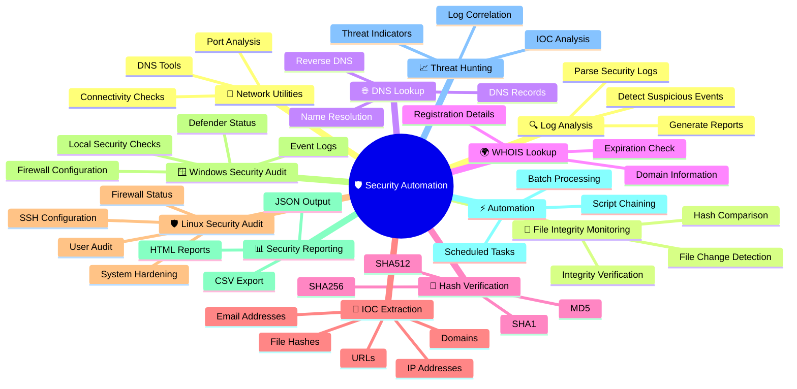
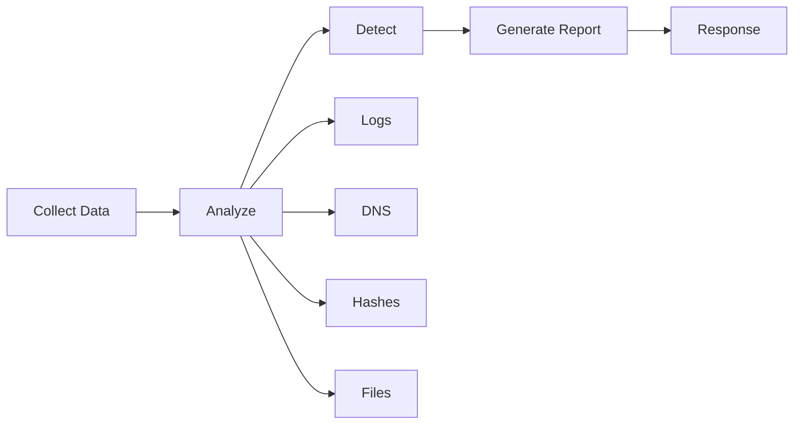
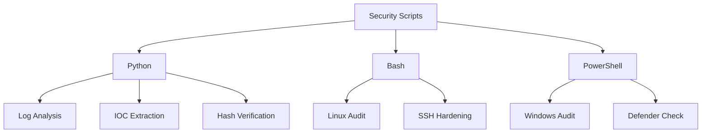
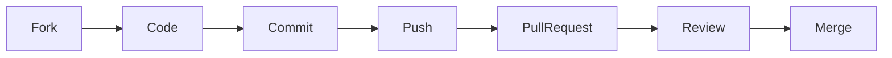

<p align="center">

</p>

<p align="center">


<div align="center">

<h3>
Cyber Defense Architect • Security Engineer • Web3 Builder
</h3>

---

# 🛡️ Security Automation Scripts

<p align="center">


</p>

---

## 📖 Overview

**Security Automation Scripts** is an open-source collection of Python, Bash, and PowerShell scripts designed to automate common cybersecurity tasks for Blue Team operations, SOC analysts, system administrators, and security enthusiasts.

This repository focuses on defensive security, security monitoring, incident response, and system auditing.

---

## ✨ Features



## 📂 Repository Structure

```mermaid
flowchart TD

    A["🛡️ Security-Automation-Scripts"]

    A --> B["📄 README.md"]
    A --> C["📜 LICENSE"]
    A --> D["📦 requirements.txt"]

    A --> E["🐍 Python Scripts"]
    A --> F["🐧 Bash Scripts"]
    A --> G["🪟 PowerShell Scripts"]

    A --> H["📚 docs"]
    A --> I["🖼️ screenshots"]
    A --> J["🧪 samples"]
    A --> K["📊 reports"]

    E --> E1["log_analyzer.py"]
    E --> E2["hash_checker.py"]
    E --> E3["ioc_extractor.py"]
    E --> E4["dns_lookup.py"]
    E --> E5["whois_lookup.py"]
    E --> E6["url_checker.py"]
    E --> E7["file_integrity_monitor.py"]
    E --> E8["password_audit.py"]
    E --> E9["yara_scanner.py"]
    E --> E10["log_parser.py"]
    E --> E11["report_generator.py"]
    E --> E12["network_monitor.py"]

    F --> F1["system_audit.sh"]
    F --> F2["firewall_status.sh"]
    F --> F3["ssh_hardening.sh"]
    F --> F4["backup_logs.sh"]
    F --> F5["user_audit.sh"]

    G --> G1["windows_audit.ps1"]
    G --> G2["defender_status.ps1"]
    G --> G3["firewall_check.ps1"]
    G --> G4["eventlog_parser.ps1"]
```



---

# 🐍 Python Scripts

| Script | Description |
|---------|-------------|
| log_analyzer.py | Analyze security logs |
| hash_checker.py | Calculate and verify file hashes |
| ioc_extractor.py | Extract IPs, URLs, Domains and Hashes |
| dns_lookup.py | DNS Information Lookup |
| whois_lookup.py | WHOIS Lookup |
| url_checker.py | URL Validation |
| file_integrity_monitor.py | Detect file modifications |
| password_audit.py | Password Strength Checker |
| yara_scanner.py | Scan files using YARA rules |
| report_generator.py | Generate HTML Reports |
| network_monitor.py | Monitor Network Connections |

---

# 🐧 Bash Scripts

| Script | Description |
|---------|-------------|
| system_audit.sh | Linux Security Audit |
| ssh_hardening.sh | SSH Hardening |
| firewall_status.sh | Firewall Status |
| backup_logs.sh | Backup Security Logs |
| user_audit.sh | User Account Audit |

---

# 🪟 PowerShell Scripts

| Script | Description |
|---------|-------------|
| windows_audit.ps1 | Windows Security Audit |
| defender_status.ps1 | Microsoft Defender Status |
| firewall_check.ps1 | Windows Firewall Audit |
| eventlog_parser.ps1 | Windows Event Log Parser |

---
## 🚀 Quick Start

### 1️⃣ Clone Repository

```bash
git clone https://github.com/kongali1720/Security-Automation-Scripts.git
cd Security-Automation-Scripts
```

### 2️⃣ Install Dependencies

```bash
pip install -r requirements.txt
```

### 3️⃣ Run a Script

| Platform | Command |
|----------|---------|
| 🐍 Python | `python python/log_analyzer.py` |
| 🐧 Linux | `bash bash/system_audit.sh` |
| 🪟 Windows | `powershell .\powershell\windows_audit.ps1` |

---

## 📊 Project Workflow



## 🗺️ Roadmap

| Status | Feature |
|:------:|---------|
| ✅ | Log Analyzer |
| ✅ | Hash Checker |
| ✅ | IOC Extractor |
| ✅ | DNS Lookup |
| ✅ | WHOIS Lookup |
| ✅ | URL Validation |
| 🚧 | VirusTotal Integration |
| 🚧 | AbuseIPDB Integration |
| 🚧 | Shodan Integration |
| 🚧 | HTML Dashboard |
| 🚧 | PDF Report Generator |
| 🚧 | Email Notification |
| 🚧 | SIEM Integration |
| 🚧 | GitHub Actions CI/CD |

## 🏗 Architecture



## 🛠 Tech Stack

<p>


</p>

## 🤝 Contributing

Contributions are always welcome!



## ⭐ Support

If this project helps you, consider supporting it by giving it a ⭐.

| ⭐ Star | 🍴 Fork | 🐛 Issue | 💡 Feature Request |
|:------:|:-------:|:-------:|:------------------:|
| Show support | Contribute | Report bugs | Suggest ideas |
# 📄 License

This project is licensed under the MIT License.

---

# 👨‍💻 Author

**Kong Ali**

Cybersecurity Enthusiast

Blue Team | Security Automation | Python | Linux | Windows | SOC

GitHub: https://github.com/kongali1720

---

<p align="center">

### 🛡️ Secure • Automate • Monitor • Defend 🛡️

Made with ❤️ for the Cybersecurity Community

</p>

<div align="center">


# ☕ Support Development


Jika project ini membantu kamu,
support kecil sangat berarti.


<a href="https://www.paypal.com/paypalme/bungtempong99/">


</a>


</div>
