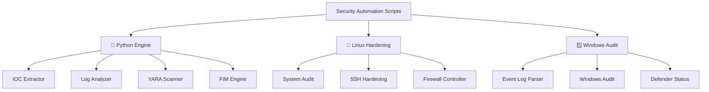
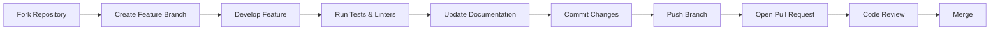

<p align="center">
  
</p>

<div align="center">

# 🛡️ Security Automation Scripts

**Enterprise-grade automation framework for Blue Team operations, SOC analysis, and proactive system hardening.**

[](https://github.com/kongali1720/Security-Automation-Scripts)
[](https://github.com/kongali1720/Security-Automation-Scripts)
[](https://github.com/kongali1720/Security-Automation-Scripts/issues)
[](LICENSE)


</div>

---

## 📖 Table of Contents

- [Overview](#-overview)
- [Key Capabilities](#-key-capabilities)
- [Core Architecture](#-core-architecture)
- [Module Reference](#-module-reference)
- [Deployment](#-deployment)
- [Usage Examples](#-usage-examples)
- [Engineering Roadmap](#-engineering-roadmap)
- [Contributing](#-contributing)
- [Repository Structure](#-repository-structure)
- [License](#-license)
- [Author](#-author)

---

## 📖 Overview

**Security Automation Scripts** merupakan kumpulan script automation lintas platform (**Python, Bash, dan PowerShell**) yang dirancang untuk membantu aktivitas Security Operations Center (SOC), Blue Team, Incident Response, Threat Hunting, serta Hardening Infrastruktur.

Framework ini mempermudah proses:

- Incident Triage
- Threat Intelligence
- Host Hardening
- Digital Forensics
- Compliance Audit
- Security Monitoring

---

## 🎯 Key Capabilities

- 🔍 **Incident Response & Triage**
  - IOC Extraction
  - Log Parsing
  - YARA Malware Detection
  - File Integrity Monitoring

- 🌐 **Attack Surface Monitoring**
  - DNS Lookup
  - WHOIS Lookup
  - External Intelligence

- 🛡️ **Host Hardening**
  - Linux Security Audit
  - Windows Security Audit
  - SSH Hardening
  - Firewall Validation

---

## 🏗️ Core Architecture



---

---

# 🗂️ Module Reference

## 🐍 Python Engine (`/python`)

| Utility | Functional Scope | Target Artifacts |
|----------|------------------|------------------|
| `log_analyzer.py` | SIEM-style log parsing and correlation | Authentication Logs, Apache, Nginx |
| `log_parser.py` | Generic log parsing engine | System & Application Logs |
| `file_integrity_monitor.py` | Baseline hashing and file integrity monitoring | Critical System Files |
| `ioc_extractor.py` | Extract Indicators of Compromise (IOC) | IP, Domain, URL, Email, Hash |
| `hash_checker.py` | Verify file integrity using cryptographic hashes | Files & Malware Samples |
| `dns_lookup.py` | DNS enumeration and lookup | Domains |
| `whois_lookup.py` | WHOIS information retrieval | Domains |
| `url_checker.py` | URL validation and inspection | URLs |
| `network_monitor.py` | Monitor active network connections | Network Sessions |
| `yara_scanner.py` | Malware detection using YARA rules | PE Files, Scripts, Documents |
| `report_generator.py` | Generate HTML & JSON security reports | Scan Results |

---

## 🐧 Linux Hardening (`/bash`)

| Utility | Functional Scope | Compliance / Target |
|----------|------------------|---------------------|
| `system_audit.sh` | Linux Security Audit | CIS Benchmark |
| `ssh_hardening.sh` | SSH Configuration Hardening | `/etc/ssh/sshd_config` |
| `firewall_status.sh` | Firewall Status Inspection | UFW / iptables / firewalld |
| `backup_logs.sh` | Backup Security Logs | `/var/log` |
| `user_audit.sh` | User Enumeration & Shadow Audit | `/etc/passwd`, `/etc/shadow` |

---

## 🪟 Windows Security (`/powershell`)

| Utility | Functional Scope | Event IDs / Target |
|----------|------------------|--------------------|
| `windows_audit.ps1` | Windows Security Audit | Defender, Build, Hotfixes |
| `eventlog_parser.ps1` | Windows Event Log Analysis | 4624, 4625, 4688, 7045 |
| `firewall_check.ps1` | Windows Firewall Inspection | Firewall Profiles |
| `defender_status.ps1` | Microsoft Defender Status | AV Engine & Signatures |

---

# 🚀 Deployment

## 📋 Prerequisites

- Python **3.10+**
- PowerShell **7+**
- Bash Shell
- Administrator / Root Privileges

---

## 1️⃣ Clone Repository

```bash
git clone https://github.com/kongali1720/Security-Automation-Scripts.git

cd Security-Automation-Scripts

pip install -r requirements.txt
```

---

## 2️⃣ IOC Extraction

```bash
python python/ioc_extractor.py \
    --input samples/suspect_payload.txt
```

---

## 3️⃣ Linux Security Audit

```bash
chmod +x bash/system_audit.sh

sudo ./bash/system_audit.sh
```

---

## 4️⃣ Windows Security Audit

```powershell
Set-ExecutionPolicy Bypass -Scope Process

.\powershell\windows_audit.ps1 -Detailed
```

---

# 📊 Usage Examples

## 🔐 File Integrity Monitoring

```bash
# Monitor /etc every 30 seconds
python python/file_integrity_monitor.py \
    -d /etc \
    --monitor \
    -i 30

# Run a one-time integrity check
python python/file_integrity_monitor.py \
    -d /etc \
    --check
```

---

## 🦠 Malware Scanning (YARA)

```bash
python python/yara_scanner.py \
    -r malware_rules/ \
    -t /tmp \
    --recursive \
    -o report.json
```

---

## 📄 Log Analysis

```bash
python python/log_analyzer.py \
    -f /var/log/auth.log \
    --json \
    -o auth_report.json
```

---

## 🪟 Windows Security Audit

```powershell
# Perform a complete Windows security audit
.\powershell\windows_audit.ps1

# Export audit results to HTML
.\powershell\windows_audit.ps1 -ExportHTML
```

---

## 📊 Engineering Roadmap
```text
Security Automation Scripts

├── ✅ Core Automation Engine
│   ├── Log Analyzer
│   ├── IOC Extractor
│   ├── YARA Scanner
│   └── File Integrity Monitor
│
├── 🚧 External Threat Intelligence
│   ├── VirusTotal
│   ├── AbuseIPDB
│   └── Shodan API
│
├── 📅 SIEM Integration
│   ├── Splunk
│   ├── Elastic Stack
│   └── Graylog
│
└── 📅 Dashboard Generator
```

---

# 🗺️ Project Roadmap

| Status | Component | Description |
|:------:|-----------|-------------|
| ✅ | Log Analysis Engine | SIEM-style log parsing and correlation |
| ✅ | IOC Extraction | Extract IPs, Domains, URLs, Emails, and File Hashes |
| ✅ | File Integrity Monitoring | Baseline hashing and file change detection |
| ✅ | Security Mapping | Security event categorization and reporting |
| 🚧 | VirusTotal Integration | Automatic file and hash reputation lookup |
| 🚧 | AbuseIPDB Integration | IP reputation and threat intelligence lookup |
| 🚧 | Shodan Integration | Internet-facing asset enrichment |
| ⬜ | SIEM Forwarder | Forward logs to Wazuh, Splunk, ELK, or Microsoft Sentinel |
| ⬜ | GitHub Actions CI/CD | Automated testing, linting, and releases |
| ⬜ | Web Dashboard | Interactive web interface for reports |
| ⬜ | HTML & PDF Reports | Executive-friendly reporting engine |
| ⬜ | Email Notifications | Automated security alert delivery |
| ⬜ | Docker Support | Containerized deployment |
| ⬜ | REST API | API for automation and third-party integration |

---

# 🤝 Contributing

Contributions are welcome and greatly appreciated!

If you'd like to improve this project, please follow these guidelines before submitting a Pull Request.

## Contribution Checklist

- ✅ Follow **PEP 8** coding standards for Python.
- ✅ Run **flake8** before committing Python code.
- ✅ Validate Bash scripts using **ShellCheck**.
- ✅ Use descriptive commit messages.
- ✅ Document every command-line option with **argparse**.
- ✅ Include practical usage examples for new modules.
- ✅ Update the README and documentation whenever new features are added.
- ✅ Ensure new scripts include comments and basic error handling.
- ✅ Test your changes before opening a Pull Request.

---

## Development Workflow


---

## 📂 Repository Structure

```text
Security-Automation-Scripts/

├── python/
│   ├── log_analyzer.py
│   ├── log_parser.py
│   ├── ioc_extractor.py
│   ├── yara_scanner.py
│   ├── file_integrity_monitor.py
│   └── report_generator.py
│
├── bash/
│   ├── system_audit.sh
│   ├── ssh_hardening.sh
│   └── user_audit.sh
│
├── powershell/
│   ├── eventlog_parser.ps1
│   └── windows_audit.ps1
│
├── requirements.txt
├── LICENSE
└── README.md
```

---

# 👨‍💻 Author

<div align="center">

## Kong Ali

**Cybersecurity Enthusiast • Security Automation Engineer • Blue Team**

[](https://github.com/kongali1720)

</div>

---

## 🎯 Focus Areas

| Domain | Description |
|---------|-------------|
| 🔵 **Blue Team Engineering** | Defensive security, monitoring, and detection engineering |
| 🔴 **Incident Response** | Investigation, containment, eradication, and recovery |
| 🛡️ **Security Automation** | Python, Bash, and PowerShell automation for security operations |
| 🔍 **Threat Hunting** | IOC analysis, threat detection, and behavioral analysis |
| 📊 **Security Operations Center (SOC)** | Log analysis, SIEM, detection, and monitoring |

---

## 💙 Support the Project

If you find this project useful, please consider supporting its development.

<div align="center">

### ⭐ Star this Repository

Giving this repository a **Star** helps increase its visibility and motivates future development.

<a href="https://github.com/kongali1720/Security-Automation-Scripts">

</a>

<br><br>

### ☕ Buy Me a Coffee

Every contribution helps support ongoing maintenance and the development of new security tools.

<a href="https://www.paypal.com/paypalme/bungtempong99">

</a>

</div>

---

<div align="center">

### 🛡️ Secure • Automate • Detect • Defend

**Made with ❤️ for the Open Source Cybersecurity Community**

</div>

<p align="center">


</p>

[](https://star-history.com/#kongali1720/Security-Automation-Scripts&Date)


---

## Code Quality Standards

| Tool | Purpose |
|------|---------|
| **flake8** | Python style and linting |
| **ShellCheck** | Bash script analysis |
| **argparse** | Standardized CLI interface |
| **GitHub Actions** | Continuous Integration (Planned) |

Thank you for helping improve **Security Automation Scripts** and contributing to the open-source cybersecurity community. 🚀
