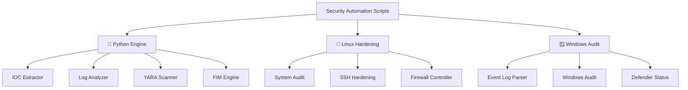

<p align="center">
  
</p>

<div align="center">

# 🛡️ Security Automation Scripts

**Enterprise-grade automation framework for Blue Team operations, SOC analysis, and proactive system hardening.**

[](https://github.com/kongali1720/Security-Automation-Scripts)
[](https://github.com/kongali1720/Security-Automation-Scripts)
[](https://github.com/kongali1720/Security-Automation-Scripts/issues)
[](LICENSE)


</div>

---

# 📖 Overview

**Security Automation Scripts** merupakan kumpulan script automation lintas platform (**Python, Bash, dan PowerShell**) yang dirancang untuk membantu aktivitas Security Operations Center (SOC), Blue Team, Incident Response, Threat Hunting, serta Hardening Infrastruktur.

Framework ini mempermudah proses:

- Incident Triage
- Threat Intelligence
- Host Hardening
- Digital Forensics
- Compliance Audit
- Security Monitoring

---

# 🎯 Key Capabilities

- 🔍 **Incident Response & Triage**
  - IOC Extraction
  - Log Parsing
  - YARA Malware Detection
  - File Integrity Monitoring

- 🌐 **Attack Surface Monitoring**
  - DNS Lookup
  - WHOIS Lookup
  - External Intelligence

- 🛡️ **Host Hardening**
  - Linux Security Audit
  - Windows Security Audit
  - SSH Hardening
  - Firewall Validation

---

# 🏗️ Core Architecture



---

# 🗂️ Module Reference

## 🐍 Python Engine (`/python`)

| Utility | Functional Scope | Target Artifacts |
|----------|------------------|------------------|
| `log_analyzer.py` | SIEM-style log parsing | Auth Logs, Apache, Nginx |
| `log_parser.py` | Dynamic log parser | Generic Log Files |
| `file_integrity_monitor.py` | Baseline hashing & drift detection | Critical System Files |
| `ioc_extractor.py` | Extract IP, Domain, URL, Hash | Threat Intelligence |
| `yara_scanner.py` | Signature malware detection | PE Files, Scripts |
| `report_generator.py` | Executive HTML Report Generator | JSON Reports |

---

## 🐧 Linux Hardening (`/bash`)

| Utility | Functional Scope | Compliance |
|----------|------------------|------------|
| `system_audit.sh` | Linux Security Audit | CIS Benchmark |
| `ssh_hardening.sh` | SSH Configuration Hardening | `/etc/ssh/sshd_config` |
| `user_audit.sh` | User Enumeration & Shadow Audit | `/etc/passwd` |

---

## 🪟 Windows Security (`/powershell`)

| Utility | Functional Scope | Event IDs |
|----------|------------------|-----------|
| `eventlog_parser.ps1` | Windows Event Log Parsing | 4624, 4625, 7045 |
| `windows_audit.ps1` | Local Security Audit | Hotfix, Build, Defender |

---

# 🚀 Deployment

## Prerequisites

- Python 3.10+
- PowerShell 7+
- Bash Shell
- Administrator / Root Privileges

---

## 1️⃣ Installation

```bash
git clone https://github.com/kongali1720/Security-Automation-Scripts.git

cd Security-Automation-Scripts

pip install -r requirements.txt
```

---

## 2️⃣ IOC Extraction

```bash
python python/ioc_extractor.py \
--input /path/to/suspect_payload.txt
```

---

## 3️⃣ Linux Security Audit

```bash
chmod +x bash/system_audit.sh

sudo ./bash/system_audit.sh
```

---

## 4️⃣ Windows Audit

```powershell
Set-ExecutionPolicy Bypass -Scope Process

.\powershell\windows_audit.ps1 -Detailed
```

---

# 📊 Engineering Roadmap

```text
Security Automation Scripts

├── ✅ Core Automation Engine
│   ├── Log Analyzer
│   ├── IOC Extractor
│   ├── YARA Scanner
│   └── File Integrity Monitor
│
├── 🚧 External Threat Intelligence
│   ├── VirusTotal
│   ├── AbuseIPDB
│   └── Shodan API
│
├── 📅 SIEM Integration
│   ├── Splunk
│   ├── Elastic Stack
│   └── Graylog
│
└── 📅 Dashboard Generator
```

---

## Progress

- ✅ Log Analysis Engine
- ✅ IOC Extraction
- ✅ File Integrity Monitoring
- ✅ Security Mapping
- 🚧 VirusTotal Integration
- 🚧 AbuseIPDB Integration
- ⬜ SIEM Forwarder
- ⬜ GitHub Actions CI/CD
- ⬜ Web Dashboard

---

# 🤝 Contributing

Kontribusi sangat diapresiasi.

Sebelum membuat Pull Request, pastikan:

- Menggunakan **flake8** untuk Python.
- Menggunakan **ShellCheck** untuk Bash.
- Dokumentasikan seluruh CLI menggunakan `argparse`.
- Sertakan contoh penggunaan.
- Update dokumentasi apabila menambah modul baru.

---

# 📂 Repository Structure

```text
Security-Automation-Scripts/

├── python/
│   ├── log_analyzer.py
│   ├── log_parser.py
│   ├── ioc_extractor.py
│   ├── yara_scanner.py
│   ├── file_integrity_monitor.py
│   └── report_generator.py
│
├── bash/
│   ├── system_audit.sh
│   ├── ssh_hardening.sh
│   └── user_audit.sh
│
├── powershell/
│   ├── eventlog_parser.ps1
│   └── windows_audit.ps1
│
├── requirements.txt
├── LICENSE
└── README.md
```

---

# 📄 License

Distributed under the **MIT License**.

See **LICENSE** for more information.

---

# 👨‍💻 Author

**Developed & Maintained by Kong Ali**

**Focus Areas**

- 🔵 Blue Team Engineering
- 🔴 Incident Response
- 🛡️ Security Automation
- 🔍 Threat Hunting
- 📊 Security Operations Center (SOC)

GitHub: **@kongali1720**

---

<div align="center">

### ⭐ If this project helps you, don't forget to leave a Star!

Made with ❤️ for the Cyber Security Community.

</div>

---

<div align="center">


# ☕ Support Development

Jika project ini membantu kamu,

support kecil sangat berarti.


<a href="https://www.paypal.com/paypalme/bungtempong99/">


</a>

</div>
